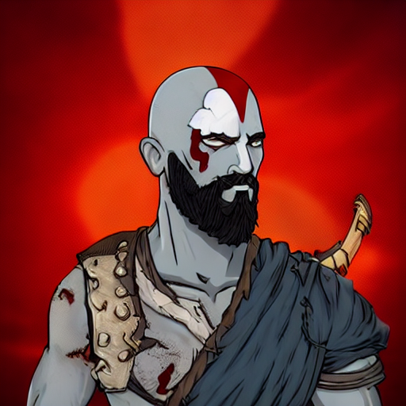
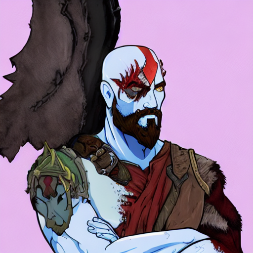
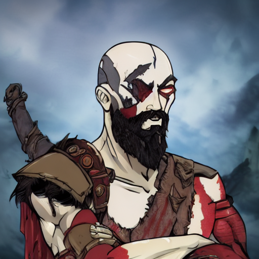

# DiffNFTGen

DiffNFTGen is a generative model designed to create high-quality Non-Fungible Token (NFT) images, with a primary focus on enhancing rarity and style transfer. Built on top of Stable Diffusion, DiffNFTGen integrates Reinforcement Learning (RL) techniques and a custom RarityReward metric to generate rare NFTs. The model employs Proximal Policy Optimization (PPO) and incorporates Kullback-Leibler (KL) divergence regularization to ensure both visual fidelity and the uniqueness of the generated NFTs.

### Generated Image Examples:
**Prompt**: *Kratos, God of War*
<table>
  <tr>
    <td><strong>SFT (Supervised Fine-tuned)</strong></td>
    <td><strong>DiffNFTGen, RR=0.5</strong></td>
    <td><strong>DiffNFTGen, RR=0.8</strong></td>
  </tr>
</table>

## Table of Contents

- [Overview](#overview)
- [Key Features](#key-features)
- [Installation](#installation)
- [Usage](#usage)
- [Training](#training)
- [Evaluation](#evaluation)
- [Results](#results)
- [Contributing](#contributing)
- [License](#license)

## Key Features

- **Rarity-Aware Generation**: Uses a custom RarityReward function to prioritize the generation of rare NFT images.
- **Reinforcement Learning**: Incorporates PPO-based reinforcement learning to fine-tune image generation.
- **Stable Diffusion Integration**: Leverages the power of Stable Diffusion for high-quality image generation.
- **Customizable Weights**: Adjust weights for RarityReward and ImageReward to balance rarity and visual appeal.

## Installation

1. **Clone the repository**:
    ```bash
    git clone https://github.com/your-username/DiffNFTGen.git
    cd DiffNFTGen
    ```

2. **Set up the environment**:
    - It is recommended to use a virtual environment for dependency management.
    ```bash
    python3 -m venv venv
    source venv/bin/activate  # On Windows, use `venv\Scripts\activate`
    ```
3. **Install the required dependencies**:
    ```bash
    pip install -r requirements.txt
    ```

4. **Training DiffNFTGen**:
    ```bash
    !accelerate launch ./train/train.py --use_ema True --prompt_path {/path/to/prompts.json} --p_batch_size 4 --reward_weight 1000 --kl_weight 0.1 --enable_rarity --ir_weight 0.2 --rarity_weight 0.8 --rarity_model_path {/path/to/vit_rarity_classifier.pth} --learning_rate 5e-5 --single_flag 0 --gradient_accumulation_steps 12 --clip_norm 0.1 --g_batch_size 6 --multi_gpu 0 --v_flag 1 --sft_path {/path/to/sft_stable_diffusion} --output_dir {/path/to/output/} --checkpointing_steps 1000 --save_interval 1000 --max_train_steps 50000
    ```
### Pre-trained Model Weights

We provide the pre-trained weights for the DiffNFTGen model.

#### Download Links:

- **DiffNFTGen RR-0.8 (Rarity Reward=0.8)**: [Download here](https://drive.google.com/file/d/13LMNEa6fsHKB2M5h7liDs9tCVlrmD9to/view?usp=sharing)
- **DiffNFTGen RR-0.5 (Rarity Reward=0.5)**: [Download here](https://drive.google.com/file/d/12IK4caXyKpV9zdVnNOR-mNZgZidONXDE/view?usp=sharing)
- **Stable Diffusion Fine-tune (SD-SFT) Weights**: [Download here](https://drive.google.com/drive/folders/1zJJhHCy48eVrTVr4pvzfsOE09WiTKIxu?usp=sharing)
- **Rarity Reward Weight (ViTB16)**: [Download here](https://drive.google.com/file/d/1bXWuZT9zJU_9aDyRRKzHsQVEURP_Vd-y/view?usp=sharing)
- **NFT Dataset**: [Download  here](https://drive.google.com/drive/folders/1XZWhW-sXgUY7ulhgTaHgh_cw7GmBjLER?usp=sharing)
```bash
python ./inference/inference.py --prompt "{prompt}" --num_images 5 --diffnftgen_weight {/path/to/diffnftgen_weight}  --sft_weight {/path/to/sft_weight} --rarity_weight {/path/to/classifier}
```
**TODO**
- Fix the requirements.txt